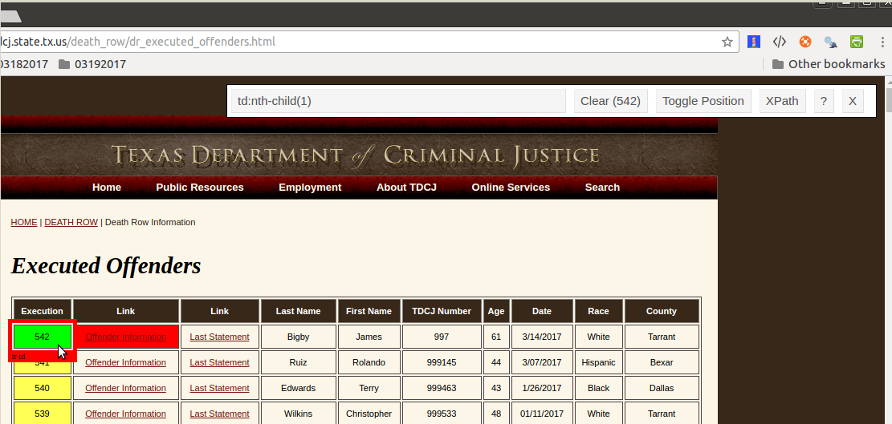

<br></br>
<br></br>
Web Scraping, is a process for extracting information that is presented on websites, also know as web harvesting or web data extraction. The website data is in HTML format (tags), which gets converted to well structured format, for easier access and use.

This can be the first step towards performing Text Mining or Natural Language Processing (NLP) (covered in my next <a>post</a>). A good understanding of HTML and CSS assists in web scraping, there a many resources on the internet for this, but here is a quick introduction to <a href="https://www.w3schools.com/html/html_intro.asp">HTML</a> and <a href="https://www.w3schools.com/css/css_intro.asp">CSS</a>.

There is a Google Chrome extension <a href="https://chrome.google.com/webstore/detail/selectorgadget/mhjhnkcfbdhnjickkkdbjoemdmbfginb">SelectorGadget</a> that will help identify and select the parts of any website and get the relevant tag information.

<div align="center">
</img>
<br></br>
<br></br>
<figcaption>Fig1. SelectorGadget installed on Google Chrome.</figcaption>
</div>
<br></br>


### Texas Department of Criminal Justice

I am going to use the Texas Department of Criminal Justice website[^1], to scrape data for further analysis. Using, Selector gadget, I have identified the CSS for use to scrape data, as seen below:


<div align="center">
</img>
<br></br>
<br></br>
<figcaption>Fig2. SelectorGadget, identified the CSS for use.</figcaption>
</div>
<br /><br />

The CSS I am going to use as a reference is "td:nth-child(1)", the first column, the remaining harvesting of data follows from that.

```{r}
# Load the necessary libraries
library(rvest)
library(xml2)

library(data.table)
library(magrittr)

library(stringi)

# for interactive charts
library(highcharter)

library(dplyr)

library(lubridate)

# using the following 2 libraries 
# for the Bootstrap-accordion rendition 
library(bsplus)
library(htmltools)
```

```{r}
# Load the page
main.page <- read_html(x = "http://www.tdcj.state.tx.us/death_row/dr_executed_offenders.html")


myTable <- data.table(html_nodes(main.page, "td:nth-child(1)"))

# get the number of rows in the table

numberOfRows <- nrow(myTable)

numberOfRows
```

I will use the numberOfRows to iterate over the whole table on the web page and extract the data, that I need. I will scrape the demographics here so that I can create interactive plots.

```{r}
for(i in numberOfRows){
  
  lastNameTable <- data.table(main.page %>%
    html_nodes("td:nth-child(4)") %>%
    html_text())
  
  firstNameTable <- data.table(main.page %>%
                                html_nodes("td:nth-child(5)") %>%
                                html_text())
  
  ageTable <- data.table(main.page %>%
                           html_nodes("td:nth-child(7)") %>%
                           html_text() %>% as.numeric())
  
  dateTable <- data.table(main.page %>%
                           html_nodes("td:nth-child(8)") %>%
                           html_text() %>% as.Date("%m/%d/%Y"))
  
  raceTable <- data.table(main.page %>%
                           html_nodes("td:nth-child(9)") %>%
                           html_text() %>% stri_trim_right() %>% as.factor())
  
  countyTable <- data.table(main.page %>%
                           html_nodes("td:nth-child(10)") %>%
                           html_text() %>% stri_trim_right() %>% as.factor())
  
}

# Combine the various tables into one table
# and rename the columns appropriately
combinedTable <- cbind(firstNameTable, lastNameTable, ageTable, dateTable, raceTable, countyTable) %>% 
  set_colnames(c("First Name", "Last Name", "Age", "Date of Execution", "Race", "County"))

summary(combinedTable)
```

```{r}

# Get a count of executions by race
byRaceCount <- count(combinedTable, Race, sort = TRUE)

hcByRace <- highchart() %>% 
  hc_chart(type = "column") %>% 
  hc_title(text = "Texas Death Row - Executions by Race") %>% 
  hc_xAxis(categories = byRaceCount$Race) %>% 
  hc_add_series(data = byRaceCount$n, name = "Executions", color = "#4CDEF5")

```

```{r}
# Get a count of executions by age
byAgeCount <- count(combinedTable, Age, sort = TRUE)

hcByAge <- highchart() %>% 
  hc_chart(type = "column") %>% 
  hc_title(text = "Texas Death Row - Executions by Age") %>% 
  hc_xAxis(categories = byAgeCount$Age) %>% 
  hc_add_series(data = byAgeCount$n, name = "Executions", color = "#FFB923")
```


```{r}

# Get a count of executions by county and just take the top 10
byCountyCountT10 <- count(combinedTable, County, sort = TRUE) %>% top_n(10)


hcByCountyT10 <- highchart() %>% 
  hc_chart(type = "column") %>% 
  hc_title(text = "Texas Death Row - Executions by County (Top 10)") %>% 
  hc_xAxis(categories = byCountyCountT10$County) %>% 
  hc_add_series(data = byCountyCountT10$n, name = "Executions", color = "#A4D555")

```

```{r}

combinedTable$Year <- year(combinedTable$`Date of Execution`)


# Get a count of executions by year
byYearCount <- count(combinedTable, Year, sort = TRUE)

hcByYear <- highchart() %>% 
  hc_chart(type = "column") %>% 
  hc_title(text = "Texas Death Row - Executions by Year") %>% 
  hc_xAxis(categories = byYearCount$Year) %>% 
  hc_add_series(data = byYearCount$n, name = "Executions", color = "#FF5992")

```

```{r}
combinedTable$Month <- month(combinedTable$`Date of Execution`, label=TRUE, abbr = FALSE)


# Get a count of executions by month
byMonthCount <- count(combinedTable, Month, sort = TRUE)

hcByMonth <- highchart() %>% 
  hc_chart(type = "column") %>% 
  hc_title(text = "Texas Death Row - Executions by Month") %>% 
  hc_xAxis(categories = byMonthCount$Month) %>% 
  hc_add_series(data = byMonthCount$n, name = "Executions", color = "#841983")

```


```{r}
combinedTable$DayofWeek <- wday(combinedTable$`Date of Execution`, label=TRUE, abbr = FALSE)


# Get a count of executions by month
byDOWCount <- count(combinedTable, DayofWeek, sort = TRUE)

hcByDOW <- highchart() %>% 
  hc_chart(type = "column") %>% 
  hc_title(text = "Texas Death Row - Executions by Day of the Week") %>% 
  hc_xAxis(categories = byDOWCount$DayofWeek) %>% 
  hc_add_series(data = byDOWCount$n, name = "Executions", color = "#DFD24D")

```

I also want a better look and feel for the notebook, something similar to a web page and decided to include an accordion to render the plots. The R packages <a href="https://cran.r-project.org/web/packages/bsplus/index.html">bsplus</a> and <a href="https://cran.r-project.org/web/packages/htmltools/index.html">htmltools</a> provided that functionality.

```{r}

bs_accordion(id = "myAccordian") %>%
bs_set_opts(panel_type = "primary", use_heading_link = TRUE) %>%
bs_append(title = "Texas Death Row: Executions by Race", content = hcByRace) %>%
bs_set_opts(panel_type = "primary") %>%
  bs_append(title = "Texas Death Row: Executions by Age", content = hcByAge) %>%
bs_set_opts(panel_type = "primary") %>%
bs_append(title = "Texas Death Row: Executions by County (Top 10)", content = hcByCountyT10) %>%
  bs_set_opts(panel_type = "primary") %>%
bs_append(title = "Texas Death Row: Executions by Year", content = hcByYear ) %>%
bs_set_opts(panel_type = "primary") %>%
bs_append(title = "Texas Death Row: Executions by Month", content = hcByMonth ) %>%
bs_set_opts(panel_type = "primary") %>%
bs_append(title = "Texas Death Row: Executions by Day of the Week", content = hcByDOW )


```

<br></br>

#### Conclusion

<br></br>
From the plots of the demographics, seen above, we can infer the following:

<ul>
  <li>Executions by Race: Percentage of whites was 45%, followed by blacks 36%.</li>
  <li>Executions by Age: The youngest was 24 years old, the oldest 67, with the maximum executed at age 38.</li>
  <li>Executions by County: Harris county had the maximum executions 23%, followed by Dallas county 10%.</li>
  <li>Executions by Year: Year 2000 saw the highest executions 40 (7.4%), with 1997 coming next with 37 (6.8%).</li>
  <li>Executions by Month: The months of January and May had the highest executions 57 (10.5%), with June at 56 and August with 50.</li>
  <li>Executions by Day of the Week: During a week, Wednesday had the highest executions 294 (38%), followed by Tuesday at 165 (30%). Sunday was the lowest with just 1 execution.</li>


###<i>Reference</i>

[^1]: http://www.tdcj.state.tx.us/death_row/dr_executed_offenders.html


